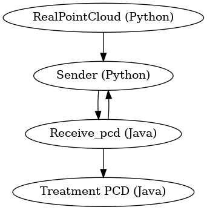

# camera_kuka

## Todo : 
- [ ] Image sender (Python)
- [ ] Image Receiver (Java)
- [ ] Point Cloud Sender (Python)
- [ ] Point Cloud Receiver (Java)
- [ ] Point Cloud merger (Java)
- [ ] Visualizer Java/Windows (PCL)
- [ ] Test on School Network
- [ ] Write Docs

## Image :

## Point Cloud : 

⢀⡴⠑⡄⠀⠀⠀⠀⠀⠀⠀⣀⣀⣤⣤⣤⣀⡀⠀⠀⠀⠀⠀⠀⠀⠀⠀⠀⠀⠀ 
⠸⡇⠀⠿⡀⠀⠀⠀⣀⡴⢿⣿⣿⣿⣿⣿⣿⣿⣷⣦⡀⠀⠀⠀⠀⠀⠀⠀⠀⠀ 
⠀⠀⠀⠀⠑⢄⣠⠾⠁⣀⣄⡈⠙⣿⣿⣿⣿⣿⣿⣿⣿⣆⠀⠀⠀⠀⠀⠀⠀⠀ 
⠀⠀⠀⠀⢀⡀⠁⠀⠀⠈⠙⠛⠂⠈⣿⣿⣿⣿⣿⠿⡿⢿⣆⠀⠀⠀⠀⠀⠀⠀ 
⠀⠀⠀⢀⡾⣁⣀⠀⠴⠂⠙⣗⡀⠀⢻⣿⣿⠭⢤⣴⣦⣤⣹⠀⠀⠀⢀⢴⣶⣆ 
⠀⠀⢀⣾⣿⣿⣿⣷⣮⣽⣾⣿⣥⣴⣿⣿⡿⢂⠔⢚⡿⢿⣿⣦⣴⣾⠁⠸⣼⡿ 
⠀⢀⡞⠁⠙⠻⠿⠟⠉⠀⠛⢹⣿⣿⣿⣿⣿⣌⢤⣼⣿⣾⣿⡟⠉⠀⠀⠀⠀⠀ 
⠀⣾⣷⣶⠇⠀⠀⣤⣄⣀⡀⠈⠻⣿⣿⣿⣿⣿⣿⣿⣿⣿⣿⡇⠀⠀⠀⠀⠀⠀ 
⠀⠉⠈⠉⠀⠀⢦⡈⢻⣿⣿⣿⣶⣶⣶⣶⣤⣽⡹⣿⣿⣿⣿⡇⠀⠀⠀⠀⠀⠀ 
⠀⠀⠀⠀⠀⠀⠀⠉⠲⣽⡻⢿⣿⣿⣿⣿⣿⣿⣷⣜⣿⣿⣿⡇⠀⠀⠀⠀⠀⠀ 
⠀⠀⠀⠀⠀⠀⠀⠀⢸⣿⣿⣷⣶⣮⣭⣽⣿⣿⣿⣿⣿⣿⣿⠀⠀⠀⠀⠀⠀⠀ 
⠀⠀⠀⠀⠀⠀⣀⣀⣈⣿⣿⣿⣿⣿⣿⣿⣿⣿⣿⣿⣿⣿⠇⠀⠀⠀⠀⠀⠀⠀ 
⠀⠀⠀⠀⠀⠀⢿⣿⣿⣿⣿⣿⣿⣿⣿⣿⣿⣿⣿⣿⣿⠃⠀⠀⠀⠀⠀⠀⠀⠀ 
⠀⠀⠀⠀⠀⠀⠀⠹⣿⣿⣿⣿⣿⣿⣿⣿⣿⣿⡿⠟⠁⠀⠀⠀⠀⠀⠀⠀⠀⠀ 
⠀⠀⠀⠀⠀⠀⠀⠀⠀⠉⠛⠻⠿⠿⠿⠿⠛⠉
